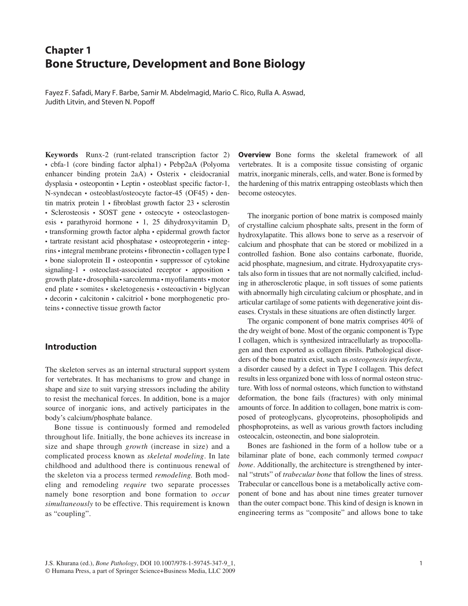
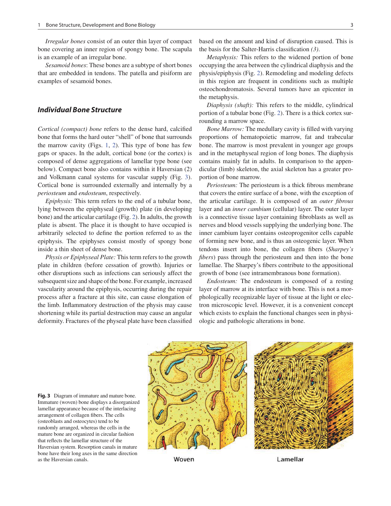

# vidts

Convert any PDF document into a narrated video with synced visuals and voiceover.

Runs locally and works offline without paid API keys.

---

## Demo

- **Video Demo**: [Watch the generated sample video on Google Drive](https://drive.google.com/file/d/1RiZo_zkr23p7DiGZst_3H4aNC2SmowT_/view?usp=sharing)

### Example Input and Output

Extracted PDF pages are matched to spoken narration line by line:

<p align="center">
  
  &nbsp;&nbsp;
  
</p>

Generated output files in the output directory:

```text
output/
|-- pages/                # Extracted page images (PNG)
|-- part_1_audio.mp3      # Combined audio track
|-- part_1_scene_*.mp3    # Per-scene audio clips
`-- part_1.mp4            # Final video file
```

---

## How It Works

1. **Extract pages**: PyMuPDF renders each PDF page to an image and extracts its text.
2. **Analyze content**: A local LLM determines the document type and key topics.
3. **Generate script**: The LLM writes page-by-page educational narration.
4. **Generate speech**: Edge TTS creates audio clips for each page.
5. **Render video**: FFmpeg combines each page image with its matching audio duration into an MP4 file.

---

## Requirements

- Python 3.11 or higher
- [Ollama](https://ollama.com) installed and running

---

## Installation

1. Clone the repository:
   ```bash
   git clone https://github.com/your-username/vidts.git
   cd vidts
   ```

2. Create and activate a virtual environment:
   ```bash
   # Windows
   python -m venv .venv
   .venv\Scripts\Activate.ps1

   # Linux / macOS
   python -m venv .venv
   source .venv/bin/activate
   ```

3. Install dependencies:
   ```bash
   pip install -r requirements.txt
   ```

4. Start Ollama and download a model:
   ```bash
   ollama serve
   ollama pull llama3.2
   ```

---

## Usage

Run the tool on a PDF file:

```bash
python -m app.main path/to/document.pdf
```

The output video will be saved to `output/part_1.mp4`.

---

## Configuration

Settings can be changed in `config.yaml`:

```yaml
llm:
  provider: ollama
  model: llama3.2
  base_url: "http://localhost:11434"
  timeout_seconds: 300

narration:
  engine: "edge-tts"
  voice: "en-US-BrianNeural"
  rate: "+0%"

segmentation:
  max_duration_minutes: 10
  max_script_words: 1800

video:
  resolution: "1920x1080"
  fps: 30
```

---

## Tests

Run the test suite:

```bash
pytest
```

---

## License

MIT
